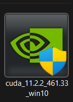

# CellenTellen
> *"One nucleus, two nuclei, three nuclei, ... Ah-ah-ah!"*
>
> Count von Count, Sesame Street

Hello and welcome to the GitHub repository of CellenTellen! This repo contains all the necessary files and the source code for the installation of CellenTellen. CellenTellen is an open source platform for nuclei segmentation. It was developed by university students of Kuleuven campus Kulak to help the research group Tissue Engineering Lab at the Department of Development and Regeneration. We hope this code could be of use to other people who are interested in segmenting cells. 

## Table of contents
* [General info](#general-info)
* [install](#How-to-install)
* [Use](#How-to-use)
* [GPU usage](#GPU-usage-with-nvidea-graphicx-card)

## General info
Hello and welcome to the GitHub repository of Cellen Tellen! This repo contains all the necessary files and the source code for the installation of Cellen Tellen. Cellen Tellen is an open source platform for nuclei segmentation. It has tools to segment, count , indicate nuclei. \\
Cellen Tellen was developed by Kulak university students. The program is fully written in python and uses Deepcell as the prediction model.
The program has been tested in windows 10/11 and is not supported in linux or macos. 

## How to install

There are two installations that need to be done, the first one is the C++ buildtools from Microsoft Visual Studio which you can install by pressing this link <a href="https://visualstudio.microsoft.com/visual-cpp-build-tools/"> here </a>. Once downloaded you'll need to restart your pc this is needed for activating the buildtools. If you prefer you can read the rest of the download section and lastly restart your pc before executing the program.
You can install the main program by clicking this <a href="https://gitlab.kuleuven.be/u0143112/graaftel/-/raw/master/Code/Graphical%20Interface/Cellen_Tellen.zip
"> link </a> which should download the zip file. Once downloaded unpack the zip file and everything should work right now. There are two ways to start the program: you can always type 'CellenTellen.exe' in your windows search bar or just make a shortcut for it on your Dekstop
 so you can always easily acces the program plus you can rename the program to 'Cellen Tellen'. After restarting your pc for the buildtools you can execute the program, it's possible it gives a firewall error which you need to ignore by pressing 'more information' and accepting the program. 

## How to use
### Nuclei and Fibre indication

The user can select some images with the `Load Images` button. These images can be imported from anywhere on the computer. It is at any point possible to load additional images in the project. The names of the images will be shown in a table together with the number of indicated nuclei, the number of indicated tropomyosin positive nuclei, the tropomyosin ratio and the number of indicated fibres. All these numbers will be set at zero by default. The user can click on an entry of the table to show the image. Under the buttons at the top of the screen, it is possible to choose which channels of the picture are shown (`Channels`). It is also possible to choose whether the currenlty indicated nuclei and fibres will be shown (`Indicators`). If some images ared loaded, the `Process Images` button will appear. This button will run the nuclei detection algorithm and start overwriting all currently indicated nuclei of all the images in the table (the indicated fibres will remain).

To interact with the shown image, the user can use the mouse buttons or keyboard buttons. If the user wants to zoom in on the picture, they need to use the mouse wheel or the *+ and *- buttons. To move the image around, the user can hold down the middle mouse button or use the arrow keys on the keyboard. Indicating a new nucleus or fibre happens with the left mouse button. Right-clicking an existing nucleus or fibre will remove it. Left-clicking an existing nucleus will transfer it from a tropomyosin positive nuclei to a negative one or vice versa. While performing these actions, the variables in the table will change for that image. Switching between interacting with the nuclei or the fibres can be done with the third button at the top of the screen. % third button , meer specifiek? 
It is only possible to select to interact with the nuclei if the indicated nuclei are also being shown, which can be selected below the buttons (at `Indicators`). Likewise, it is not possible to interact with the fibres if the indicated fibres are not being shown.

### Projects

The user can save working spaces in projects. Initially, i.e. after starting the program, a new empty and unsaved work space is loaded in which the user can start selecting images. Creating a new project folder and saving the current space in that folder is done by choosing `Save Project As` in the File menu. After providing a name for the project, the current working space will be saved in that folder. 

Loading a project folder can be done directly from the `Recent Projects` option in the menu as well as from the `Load From Explorer` option in the menu. This option will guide the user to the folder where all the saved projects are located. Choosing one of the project folders will load that project. In the File menu, it is also possible to delete the current project or start a new empty project (make sure to save the current working space or project before doing this). Finally, the option `Load Automatic Save` in the File menu will load the latest automatic save.

After loading a project folder or saving the current working space to a project folder, the user will now be working inside of that project. This can be seen in the title of the window. This title will also indicate if the current working space or project is unsaved. If the user is working inside of a project, it is possible to save the current working space immediately to that project by clicking the `Save` button at the top right of the window. 

All projects are saved in one folder which was automatically created by the program, the user is expected to only alter these projects folders through the interface.

### Settings

In the Settings menu, available in the menu bar, there are a number of options. Firstly, it is possible to indicate which channels are occupied by the nuclei and the fibres. The automatic nuclei and fibre detection is based on these selections. Secondly, the user can indicate how long the autosave interval is, this is the interval between automatically saving the current project to the automatic save folder. Lastly, it is possible to choose to save the altered images when saving projects. These altered images are the original images with the indicated nuclei and fibres drawn on them.

## GPU usage with nvidea graphicx card
Our program supports GPU usage. In order to know check if you have a nvidea graphicx card, you can search for ´device manager´ in the windows search bar. Thereafter, go to display adapter and you'll find your processors.
First of all, you need to install the right *Cuda version. As we use `tensorflow version 2.5.1`, you'll need to install `Cuda version 11.2` which can be found at the official nvidea website. You can click the link 
<a href="https://developer.download.nvidia.com/compute/cuda/11.2.2/local_installers/cuda_11.2.2_461.33_win10.exe">
here 
</a> to install directly. This version of Cuda which is only intended for `windows 10` and `windows 11`. 

After the (hopefully) succesfull installation of Cuda, we need to install *cudnn. 
Unfortunalty, to install cudnn you do need to log into the official website of nvidea. You can click
<a href=https://developer.nvidia.com/compute/machine-learning/cudnn/secure/8.1.1.33/11.2_20210301/cudnn-11.2-windows-x64-v8.1.1.33.zip>
here </a> to do so.
After logging in or registering, it should have automatically downloaded the zip-folder. If not, click 
<a href=https://developer.nvidia.com/compute/machine-learning/cudnn/secure/8.1.1.33/11.2_20210301/cudnn-11.2-windows-x64-v8.1.1.33.zip>
here
</a> again.
If dowloaded, follow the next steps below. 
Click on the cuda executable which you have downloaded.

Follow the installation instruction as seen in the images below. 

|  blah |  
|  blah |  
|  blah |  
|  blah

When The installaton is complete, you can open the folder ´NVIDEA GPU computing toolkit´ which you can find by going to ´This PC´ and then ´C:\Program Files´. 
When open, you'll see a folder named ´CUDA´, which you need to open, Thereafter you'll find a folder called ´v11.2´ which you need to open as well. In this folder you will need to paste all the contents that are in the cudnn folder which you have downloaded earlier. This is shown in the images below. 

|  blah |  

